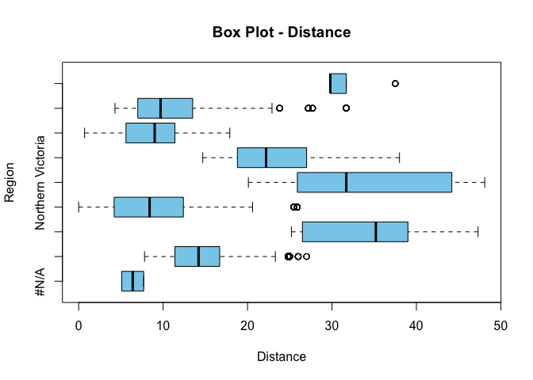
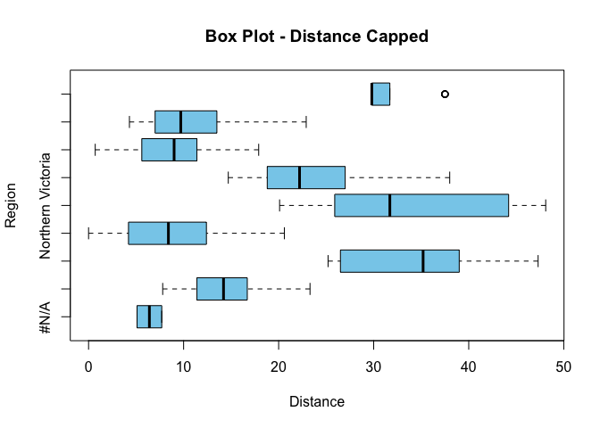
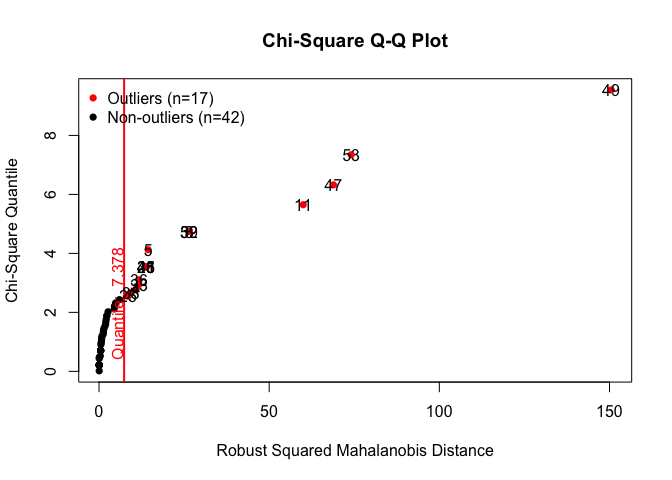
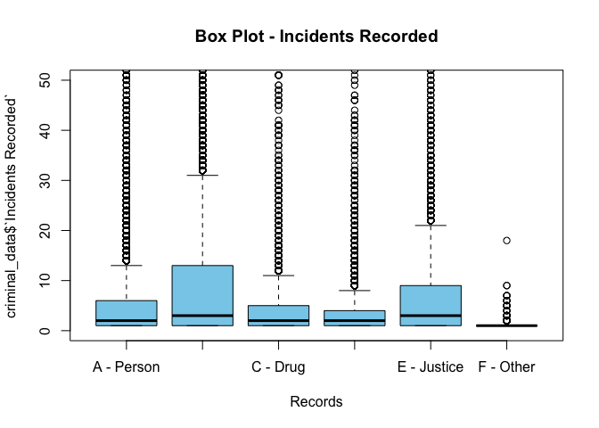
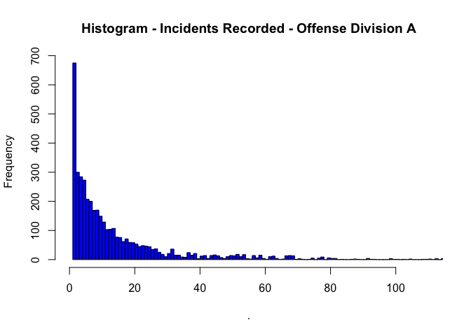
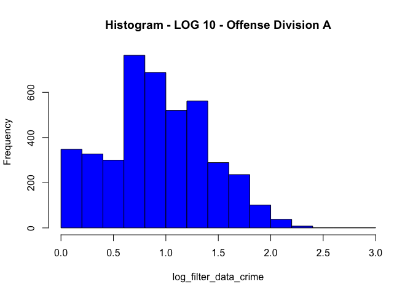
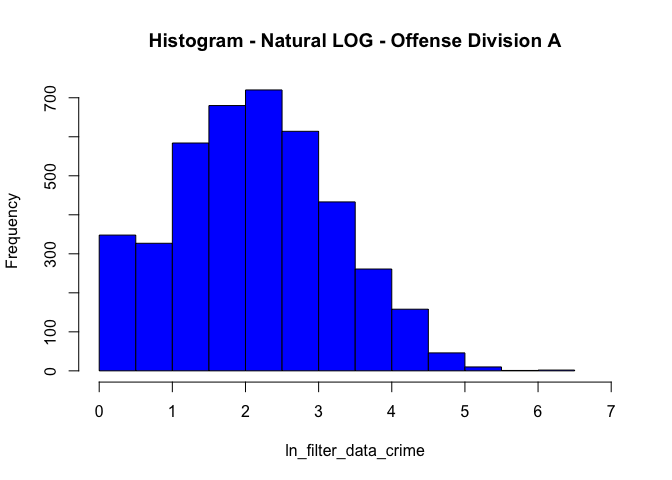
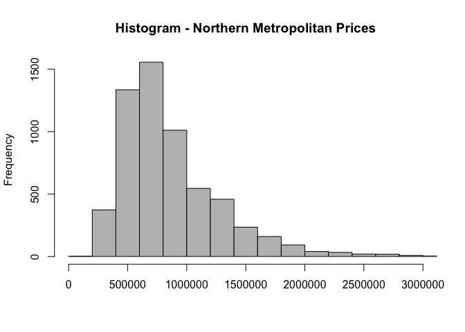
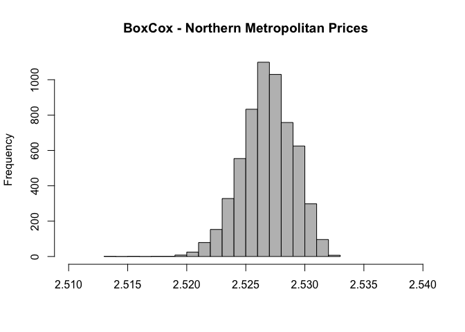

Data Wrangling In R \| Housing and Crime Data Sets
================
Adam Pirsl S3815427


# Required packages

``` r
library(readr)
#library(xlsx)
library(readxl)
library(foreign)
library(gdata)
#library(rvst)
library(dplyr)
library(tidyr)
library(deductive)
library(deducorrect)
library(editrules)
library(validate)
library(Hmisc)
library(forecast)
library(stringr)
library(lubridate)
library(car)
library(outliers)
library(MVN)
library(MASS)
library(caret)
library(mlr)
library(ggplot2)
library(knitr)
library(magrittr)

setwd("~/Documents/RMIT/Archive/Data Preprocessing/Assessments/Assignment 3")
```

# Executive Summary

The purpose of this report is to analyse Melbourne Housing data against
Victorian crime statistics. The datasets have been taken from Kaggle and
Crime Statistics Victoria, both of which hold Creative Common licenses.
Data wrangling techniques have been applied to the datasets such as
scanning for nulls, scanning for outliers, tidy data techniques, joining
data sets together, mutating variables and transforming the final output
to better understand the results.

The first step was to import and understand the dataset and apply the
appropriate format changes to each variable. We then scanned for nulls
and found that the Melbourne Housing data contained NA values under the
Price variable. They were treated by applying an median value based on
the equivalent Suburb, Room and Type of dwelling. For each NA value that
could not be grouped by at least 2 of these variables was removed. The
same process was repeated for Landsize. A function rule was also
employed to detect abnormalities in the data, such as postcodes with
negative inputs or postcodes that fall outside of Victoria, of which no
values were detected.

The next step was to identify and treat outliers under the Distance
variable by Regionname on a boxplot. There were obvious outliers that
were treated using Windsoring. The price variable was assesed using the
z-score approach and outliers replaced with an average. A case study
into the Mahalanob distance distance was conducted on the suburb of East
Melbourne, however the outliers were not removed due to the Price
variable already being treated.

The data sets were merged using a left join on the postcode. It was
concluded that the final output was in a tidy format as it adhered to
the tidy data principles. A new variable called Percentage\_Postcode was
mutated by calculating the percentage of each type of Offence Division
against the total number of offenses for that postcode.

Lastly, the Offense Division variable underwent transformation to
further understand trends in the data. A base histogram of the Offense
Type A showed a right skew. After applying log and log10
transformations, the intensity of the Offense Type became more
normalised. A boxcox transformation was applied to the Price variable of
Northern Metropolitan region, which found the data to be slightly left
skewed and the median at approximately 2.535 mark.

# Data

The Melbourne Housing Market dataset has been sourced from Kaggle.com.
The data set contains housing metrics from dwellings sold in Melbourne
between January 2016 and March 2018. The dataset was obtained in csv
format. Metrics include location data such as postcode, suburb and
address of the sold dwelling, as well as dwelling specific data such as
number of rooms/bedrooms/parking, land size and building area.

The Criminal Incidents data set was sourced from Crime Statistics
Victoria. The data set contains volumes of criminal incidents recorded
in each postcode of Victoria between June 2009 and June 2018. The
dataset was obtained in xlsx format. The type of criminal incidents are
broken up into 6 categories under the ‘Offence Divisions’ variable. For
each category, the data is further segmented into different subdivisions
and subgroups. The right-most varible called ‘Incidents Recorded’
contains a count of that particular offence.

Firstly, we have assigned the working directory to a local drive. We
have used readr library to import the Melbourne Housing dataset and then
provided a snapshot of the data using the head() function in order to
assess the type of variables. We have isolated the neccessary variables
for our analysis using dplyer select() function.

We have then imported the Crime Statistics Victoria datset using the
readexcel library and providing a snapshot of the dataset using the
head() function.

``` r
setwd("~/Documents/RMIT/Archive/Data Preprocessing/Assessments/Assignment 3")

                          # Import housing dataset
# https://www.kaggle.com/anthonypino/melbourne-housing-market/
Melbourne_housing <- read_csv("Melbourne_housing_FULL.csv")
```

    ## 
    ## ── Column specification ────────────────────────────────────────────────────────
    ## cols(
    ##   .default = col_double(),
    ##   Suburb = col_character(),
    ##   Address = col_character(),
    ##   Type = col_character(),
    ##   Method = col_character(),
    ##   SellerG = col_character(),
    ##   Date = col_character(),
    ##   CouncilArea = col_character(),
    ##   Regionname = col_character()
    ## )
    ## ℹ Use `spec()` for the full column specifications.

    ## Warning: 2 parsing failures.
    ##   row           col expected actual                         file
    ## 18524 Propertycount a double   #N/A 'Melbourne_housing_FULL.csv'
    ## 26889 Propertycount a double   #N/A 'Melbourne_housing_FULL.csv'

``` r
#Trim variables
Melbourne_housing <-  Melbourne_housing %>%  dplyr::select(Suburb,  Rooms,  Type,   Price, Date, Distance, Postcode, Regionname,    Landsize) 
head(Melbourne_housing)
```

    ## # A tibble: 6 x 9
    ##   Suburb   Rooms Type    Price Date   Distance Postcode Regionname      Landsize
    ##   <chr>    <dbl> <chr>   <dbl> <chr>     <dbl>    <dbl> <chr>              <dbl>
    ## 1 Abbotsf…     2 h          NA 3/9/16      2.5     3067 Northern Metro…      126
    ## 2 Abbotsf…     2 h     1480000 3/12/…      2.5     3067 Northern Metro…      202
    ## 3 Abbotsf…     2 h     1035000 4/2/16      2.5     3067 Northern Metro…      156
    ## 4 Abbotsf…     3 u          NA 4/2/16      2.5     3067 Northern Metro…        0
    ## 5 Abbotsf…     3 h     1465000 4/3/17      2.5     3067 Northern Metro…      134
    ## 6 Abbotsf…     3 h      850000 4/3/17      2.5     3067 Northern Metro…       94

``` r
                          # Import crime data set
# https://www.crimestatistics.vic.gov.au/crime-statisticshistorical-crime-datayear-ending-30-june-2018/download-data
criminal_data <- read_excel("Data_tables_Criminal_Incidents_Visualisation_year_ending_June_2018.xlsx", 
     sheet = "Table 07")
criminal_data <- criminal_data %>% filter(`Year ending June` == 2018)
head(criminal_data)
```

    ## # A tibble: 6 x 7
    ##   `Year ending Jun… Postcode `Suburb/Town Na… `Offence Divisi… `Offence Subdivi…
    ##               <dbl>    <dbl> <chr>            <chr>            <chr>            
    ## 1              2018     3000 MELBOURNE        A Crimes agains… A20 Assault and …
    ## 2              2018     3000 MELBOURNE        A Crimes agains… A20 Assault and …
    ## 3              2018     3000 MELBOURNE        A Crimes agains… A20 Assault and …
    ## 4              2018     3000 MELBOURNE        A Crimes agains… A20 Assault and …
    ## 5              2018     3000 MELBOURNE        A Crimes agains… A20 Assault and …
    ## 6              2018     3000 MELBOURNE        A Crimes agains… A50 Robbery      
    ## # … with 2 more variables: Offence Subgroup <chr>, Incidents Recorded <dbl>

# Understand

By applying the Str() function to our datasets, we are able to view the
attributes and formats of the variables.

The Postcode variable in the Melbourne Housing data set is in a
character format and in the Criminal dataset it is in numeric. As we
will be joining the dataset on postcodes, we have converted the postcode
from character to integer format to facilitate the join. The Date format
has been updated to dd-dd-yyy format using the as.Date function. This
will assist with extract the specific days, months and year metrics if
needed. The Type variable was updated to be a factor variable using
lapply.

Criminal Data: The offense Division variable was converted from a
character to an ordered factor and the naming convention was updated.
The levels functionality was included to indicate the severity the
offence type. The Postcode and Date Ending June variables were updated
and applied to the dataset using lapply. To ensure the format changes
have taken place, the str() function was applied to the final outputs
and results assessed.

``` r
                        # Summarise the Housing data
str(Melbourne_housing)
```

    ## tibble[,9] [34,856 × 9] (S3: tbl_df/tbl/data.frame)
    ##  $ Suburb    : chr [1:34856] "Abbotsford" "Abbotsford" "Abbotsford" "Abbotsford" ...
    ##  $ Rooms     : num [1:34856] 2 2 2 3 3 3 4 4 2 2 ...
    ##  $ Type      : chr [1:34856] "h" "h" "h" "u" ...
    ##  $ Price     : num [1:34856] NA 1480000 1035000 NA 1465000 ...
    ##  $ Date      : chr [1:34856] "3/9/16" "3/12/16" "4/2/16" "4/2/16" ...
    ##  $ Distance  : num [1:34856] 2.5 2.5 2.5 2.5 2.5 2.5 2.5 2.5 2.5 2.5 ...
    ##  $ Postcode  : num [1:34856] 3067 3067 3067 3067 3067 ...
    ##  $ Regionname: chr [1:34856] "Northern Metropolitan" "Northern Metropolitan" "Northern Metropolitan" "Northern Metropolitan" ...
    ##  $ Landsize  : num [1:34856] 126 202 156 0 134 94 120 400 201 202 ...
    ##  - attr(*, "problems")= tibble[,5] [2 × 5] (S3: tbl_df/tbl/data.frame)
    ##   ..$ row     : int [1:2] 18524 26889
    ##   ..$ col     : chr [1:2] "Propertycount" "Propertycount"
    ##   ..$ expected: chr [1:2] "a double" "a double"
    ##   ..$ actual  : chr [1:2] "#N/A" "#N/A"
    ##   ..$ file    : chr [1:2] "'Melbourne_housing_FULL.csv'" "'Melbourne_housing_FULL.csv'"

``` r
# Change the postcode to a integer in order to allow a join onto criminal dataset
convert_to_integer <- Melbourne_housing[, c(7)]
Melbourne_housing[, c(7)] <- lapply(convert_to_integer, as.integer)
# Change date format
convert_to_date <- Melbourne_housing[, c(5)]
Melbourne_housing[, c(5)] <- lapply(convert_to_date, as.Date, "%d/%m/%y")
head(Melbourne_housing)
```

    ## # A tibble: 6 x 9
    ##   Suburb  Rooms Type    Price Date       Distance Postcode Regionname   Landsize
    ##   <chr>   <dbl> <chr>   <dbl> <date>        <dbl>    <int> <chr>           <dbl>
    ## 1 Abbots…     2 h          NA 2016-09-03      2.5     3067 Northern Me…      126
    ## 2 Abbots…     2 h     1480000 2016-12-03      2.5     3067 Northern Me…      202
    ## 3 Abbots…     2 h     1035000 2016-02-04      2.5     3067 Northern Me…      156
    ## 4 Abbots…     3 u          NA 2016-02-04      2.5     3067 Northern Me…        0
    ## 5 Abbots…     3 h     1465000 2017-03-04      2.5     3067 Northern Me…      134
    ## 6 Abbots…     3 h      850000 2017-03-04      2.5     3067 Northern Me…       94

``` r
# Change Type to factor
convert_to_factor <- Melbourne_housing[,c(3)]
Melbourne_housing[, c(3)]<- lapply(convert_to_factor, factor)
# Change Rooms to integer
convert_to_integer <- Melbourne_housing[, c(2)]
Melbourne_housing[, c(2)] <- lapply(convert_to_integer, as.integer)

head(Melbourne_housing)
```

    ## # A tibble: 6 x 9
    ##   Suburb  Rooms Type    Price Date       Distance Postcode Regionname   Landsize
    ##   <chr>   <int> <fct>   <dbl> <date>        <dbl>    <int> <chr>           <dbl>
    ## 1 Abbots…     2 h          NA 2016-09-03      2.5     3067 Northern Me…      126
    ## 2 Abbots…     2 h     1480000 2016-12-03      2.5     3067 Northern Me…      202
    ## 3 Abbots…     2 h     1035000 2016-02-04      2.5     3067 Northern Me…      156
    ## 4 Abbots…     3 u          NA 2016-02-04      2.5     3067 Northern Me…        0
    ## 5 Abbots…     3 h     1465000 2017-03-04      2.5     3067 Northern Me…      134
    ## 6 Abbots…     3 h      850000 2017-03-04      2.5     3067 Northern Me…       94

``` r
                          # Summarise the Criminal Data
str(criminal_data)
```

    ## tibble[,7] [31,958 × 7] (S3: tbl_df/tbl/data.frame)
    ##  $ Year ending June   : num [1:31958] 2018 2018 2018 2018 2018 ...
    ##  $ Postcode           : num [1:31958] 3000 3000 3000 3000 3000 3000 3000 3000 3000 3000 ...
    ##  $ Suburb/Town Name   : chr [1:31958] "MELBOURNE" "MELBOURNE" "MELBOURNE" "MELBOURNE" ...
    ##  $ Offence Division   : chr [1:31958] "A Crimes against the person" "A Crimes against the person" "A Crimes against the person" "A Crimes against the person" ...
    ##  $ Offence Subdivision: chr [1:31958] "A20 Assault and related offences" "A20 Assault and related offences" "A20 Assault and related offences" "A20 Assault and related offences" ...
    ##  $ Offence Subgroup   : chr [1:31958] "A211 FV Serious assault" "A212 Non-FV Serious assault" "A22 Assault police, emergency services or other authorised officer" "A231 FV Common assault" ...
    ##  $ Incidents Recorded : num [1:31958] 109 561 147 132 644 144 25 22 29 10 ...

``` r
# Change offense division to factor with levels
convert_to_factor <- criminal_data[,c(4)]
str(criminal_data$`Offence Division`)
```

    ##  chr [1:31958] "A Crimes against the person" "A Crimes against the person" ...

``` r
criminal_data[,c(4)] <- lapply(convert_to_factor, factor, 
                                    levels = c(
                            'A Crimes against the person', 
                            'B Property and deception offences', 
                            'C Drug offences', 
                            'D Public order and security offences', 
                            'E Justice procedures offences',
                            'F Other offences'
                                            ),
                                    labels = c(
                            'A Crimes against the person' = 'A - Person', 
                            'B Property and deception offences' = 'B - Deception', 
                            'C Drug offences' = 'C - Drug', 
                            'D Public order and security offences' = 'D - Security',
                            'E Justice procedures offences' = 'E - Justice', 
                            'F Other offences' = 'F - Other'),
                                    order = TRUE
                                            )

# Change postcode to integer
convert_to_integer <- criminal_data[, c(2)]
criminal_data[, c(2)] <- lapply(convert_to_integer, as.integer)

# Change `Year ending June` to integer
convert_to_integer <- criminal_data[, c(1)]
criminal_data[, c(1)] <- lapply(convert_to_integer, as.integer)

head(criminal_data)
```

    ## # A tibble: 6 x 7
    ##   `Year ending Jun… Postcode `Suburb/Town Na… `Offence Divisi… `Offence Subdivi…
    ##               <int>    <int> <chr>            <ord>            <chr>            
    ## 1              2018     3000 MELBOURNE        A - Person       A20 Assault and …
    ## 2              2018     3000 MELBOURNE        A - Person       A20 Assault and …
    ## 3              2018     3000 MELBOURNE        A - Person       A20 Assault and …
    ## 4              2018     3000 MELBOURNE        A - Person       A20 Assault and …
    ## 5              2018     3000 MELBOURNE        A - Person       A20 Assault and …
    ## 6              2018     3000 MELBOURNE        A - Person       A50 Robbery      
    ## # … with 2 more variables: Offence Subgroup <chr>, Incidents Recorded <dbl>

``` r
str(Melbourne_housing)
```

    ## tibble[,9] [34,856 × 9] (S3: tbl_df/tbl/data.frame)
    ##  $ Suburb    : chr [1:34856] "Abbotsford" "Abbotsford" "Abbotsford" "Abbotsford" ...
    ##  $ Rooms     : int [1:34856] 2 2 2 3 3 3 4 4 2 2 ...
    ##  $ Type      : Factor w/ 3 levels "h","t","u": 1 1 1 3 1 1 1 1 1 1 ...
    ##  $ Price     : num [1:34856] NA 1480000 1035000 NA 1465000 ...
    ##  $ Date      : Date[1:34856], format: "2016-09-03" "2016-12-03" ...
    ##  $ Distance  : num [1:34856] 2.5 2.5 2.5 2.5 2.5 2.5 2.5 2.5 2.5 2.5 ...
    ##  $ Postcode  : int [1:34856] 3067 3067 3067 3067 3067 3067 3067 3067 3067 3067 ...
    ##  $ Regionname: chr [1:34856] "Northern Metropolitan" "Northern Metropolitan" "Northern Metropolitan" "Northern Metropolitan" ...
    ##  $ Landsize  : num [1:34856] 126 202 156 0 134 94 120 400 201 202 ...
    ##  - attr(*, "problems")= tibble[,5] [2 × 5] (S3: tbl_df/tbl/data.frame)
    ##   ..$ row     : int [1:2] 18524 26889
    ##   ..$ col     : chr [1:2] "Propertycount" "Propertycount"
    ##   ..$ expected: chr [1:2] "a double" "a double"
    ##   ..$ actual  : chr [1:2] "#N/A" "#N/A"
    ##   ..$ file    : chr [1:2] "'Melbourne_housing_FULL.csv'" "'Melbourne_housing_FULL.csv'"

``` r
str(criminal_data)
```

    ## tibble[,7] [31,958 × 7] (S3: tbl_df/tbl/data.frame)
    ##  $ Year ending June   : int [1:31958] 2018 2018 2018 2018 2018 2018 2018 2018 2018 2018 ...
    ##  $ Postcode           : int [1:31958] 3000 3000 3000 3000 3000 3000 3000 3000 3000 3000 ...
    ##  $ Suburb/Town Name   : chr [1:31958] "MELBOURNE" "MELBOURNE" "MELBOURNE" "MELBOURNE" ...
    ##  $ Offence Division   : Ord.factor w/ 6 levels "A - Person"<"B - Deception"<..: 1 1 1 1 1 1 1 1 1 1 ...
    ##  $ Offence Subdivision: chr [1:31958] "A20 Assault and related offences" "A20 Assault and related offences" "A20 Assault and related offences" "A20 Assault and related offences" ...
    ##  $ Offence Subgroup   : chr [1:31958] "A211 FV Serious assault" "A212 Non-FV Serious assault" "A22 Assault police, emergency services or other authorised officer" "A231 FV Common assault" ...
    ##  $ Incidents Recorded : num [1:31958] 109 561 147 132 644 144 25 22 29 10 ...

# Scan I

Firstly, we have used the colSum(is.na) method to identify where there
are NA values in each dataset. Using the colSum() function, we were able
to identify the sum of all nulls under each variable. We identified
7,610 and 11,809 NA’s under Melbourne Housing Price and Landsize
respectively.

The NA values under Price were dealt with using median values for
similar properties grouped by Suburb, Room and Type. After checking the
NA’s using colSum(), we identified that there were still 205 NA values.
This was due to limited data observations being available to calculate
median where Rooms value is high. We have removed Rooms from the
group\_by function to calculate the median by Suburb and Type, which
would still provide an accurate representation of dwelling prices. The
remaining NA values were removed from the dataset. The NA’s under
Landsize were dealt with using mean values for Landsize grouped by
Suburb, Room and Type. The remaining NA’s were removed from the dataset.
This method was used as it is it aligns to real methods used by real
estate agents for sestimations.

Furthermore, we have tested for infinite values using is.specialorNA
function that is assigned to an function(x). The output reports no
infinite values for Melbourne Housing and Criminal dataset.

The final method was to create a set of rules to validate Price values
were greater than 0 and that postcodes were limited to Victoria.

``` r
                                              # Housing Data Set
# Identify which ones are NA cells
which(is.na(Melbourne_housing)) %>%  head()
```

    ## [1] 104569 104572 104576 104577 104578 104581

``` r
# Identify how many NA's under each variable
pre <- colSums(is.na(Melbourne_housing))
head(pre,9)
```

    ##     Suburb      Rooms       Type      Price       Date   Distance   Postcode 
    ##          0          0          0       7610          0          0          0 
    ## Regionname   Landsize 
    ##          0      11809

``` r
# Median values for price 
    # Median by Suburb,Rooms,Type
    Melbourne_housing <- Melbourne_housing %>% group_by(Suburb,Rooms,Type) %>%
    mutate(Price=ifelse(is.na(Price),median(Price,na.rm=TRUE),Price))
    # Median by Suburb,Type
    Melbourne_housing <- Melbourne_housing %>% group_by(Suburb,Type) %>%
    mutate(Price=ifelse(is.na(Price),median(Price,na.rm=TRUE),Price))
    # Remove remaining NA values
      Melbourne_housing$Price[is.na(Melbourne_housing$Price)] <-        mean(Melbourne_housing$Price, na.rm = TRUE)

# Average house value for Landsize
    # Average by Suburb,Rooms,Type
    Melbourne_housing <- Melbourne_housing %>% group_by(Suburb,Rooms,Type) %>%
    mutate(Landsize=ifelse(is.na(Landsize),mean(Landsize,na.rm=TRUE),Landsize))
    # Average by Suburb,Rooms
    Melbourne_housing <- Melbourne_housing %>% group_by(Suburb,Type) %>%
    mutate(Landsize=ifelse(is.na(Landsize),mean(Landsize,na.rm=TRUE),Landsize))
    # Average by Suburb
    Melbourne_housing <- Melbourne_housing %>% group_by(Suburb) %>%
    mutate(Landsize=ifelse(is.na(Landsize),mean(Landsize,na.rm=TRUE),Landsize))  
    # Remove remaining NA values
    Melbourne_housing$Landsize[is.na(Melbourne_housing$Landsize)] <- mean(Melbourne_housing$Landsize, na.rm = TRUE)
    
# Confirm there are no more NA values
post <- colSums(is.na(Melbourne_housing))
head(post,9)
```

    ##     Suburb      Rooms       Type      Price       Date   Distance   Postcode 
    ##          0          0          0          0          0          0          0 
    ## Regionname   Landsize 
    ##          0          0

``` r
# Check for finite and infinite values
is.specialorNA <- function(x){
if (is.numeric(x)) (is.infinite(x) | is.nan(x) | is.na(x))
}
sapply(Melbourne_housing, function(x) sum(is.infinite(x)))
```

    ##     Suburb      Rooms       Type      Price       Date   Distance   Postcode 
    ##          0          0          0          0          0          0          0 
    ## Regionname   Landsize 
    ##          0          0

``` r
# Make sure ther are no negative values in Prices
Home_Rules <- editset(c("Price > 0",
                        "Landsize >= 0",
                        "Distance >= 0",
                        "Postcode > 0"))
violated_home <- violatedEdits(Home_Rules, Melbourne_housing)
head(summary(violated_home))
```

    ## No violations detected, 0 checks evaluated to NA

    ## NULL

``` r
head(Melbourne_housing)
```

    ## # A tibble: 6 x 9
    ## # Groups:   Suburb [1]
    ##   Suburb  Rooms Type    Price Date       Distance Postcode Regionname   Landsize
    ##   <chr>   <int> <fct>   <dbl> <date>        <dbl>    <int> <chr>           <dbl>
    ## 1 Abbots…     2 h     1097000 2016-09-03      2.5     3067 Northern Me…      126
    ## 2 Abbots…     2 h     1480000 2016-12-03      2.5     3067 Northern Me…      202
    ## 3 Abbots…     2 h     1035000 2016-02-04      2.5     3067 Northern Me…      156
    ## 4 Abbots…     3 u     1090000 2016-02-04      2.5     3067 Northern Me…        0
    ## 5 Abbots…     3 h     1465000 2017-03-04      2.5     3067 Northern Me…      134
    ## 6 Abbots…     3 h      850000 2017-03-04      2.5     3067 Northern Me…       94

``` r
                                        # Criminal dataset

# Identify which ones are NA cells
which(is.na(criminal_data)) %>%  head()
```

    ## integer(0)

``` r
# Identify how many NA's under each variable
colSums(is.na(criminal_data))
```

    ##    Year ending June            Postcode    Suburb/Town Name    Offence Division 
    ##                   0                   0                   0                   0 
    ## Offence Subdivision    Offence Subgroup  Incidents Recorded 
    ##                   0                   0                   0

``` r
# Check for finite and infinite values
special_values <- sum(
    sapply(criminal_data, function(x) sum(is.infinite(x))),
    sapply(criminal_data, function(x) sum(is.nan(x))),
    sapply(criminal_data, function(x) sum(is.na(x)))
    )
head(special_values)
```

    ## [1] 0

``` r
# Make sure ther are no negative values in Incidents Recorded
Criminal_Rules <- editset(c("Postcode > 0",
                            "Postcode < 3999"))
violated_criminal <- violatedEdits(Criminal_Rules, criminal_data)
summary(violated_criminal)
```

    ## No violations detected, 0 checks evaluated to NA

    ## NULL

# Scan II

The ‘Distance’ variable was assessed for outliers using a boxplot that
is grouped by Regionname. There were obvious outliers that we removed
using the capped approach (or Winsoring method). This method involved
limiting the values to the upper and lower limits of the boxplot and
then reinserting those values back into the main dataset. A new boxplot
of the dataset confirms that the outliers were removed successfully.

The price variable was assesed for outliers using the Z-Score approach,
where there were 581 values that have a z-score &gt;3. We have handled
the outliers by replacing them with average house prices.

We have analysed the Mahalanobis distance of East Melbourne (Landsize,
Price and Rooms) for outliers. Although the results show dots past the
chi squared value, we have already removed outliers in price and
distance and do not need to remove these outliers.

Using a boxplot, it was determined that the criminal dataset has high
number of outliers per Offense Division. However, given the high number
of ‘outliers’, any data trasnformation would alter the analysis too much
and therefore no changes were made to this variable.

``` r
                                # Outliers in Housing Data
## Distance
# Test for outliers
Melbourne_housing_test <-boxplot(Melbourne_housing$Distance ~ Melbourne_housing$Regionname, main="Box Plot - Distance", xlab="Distance",horizontal=TRUE, ylab = "Region",col = "skyblue")
```

<!-- -->

``` r
# 1
cap <- function(x){
    quantiles <- quantile( x, c(.05, 0.25, 0.75, .95 ) )
    x[ x < quantiles[2] - 1.5*IQR(x) ] <- quantiles[1]
    x[ x > quantiles[3] + 1.5*IQR(x) ] <- quantiles[4]
    x              } 

# 2
no_outliers <- as.data.frame(Melbourne_housing$Distance) %>%
  group_by(Melbourne_housing$Regionname) %>%
  mutate_all(cap)
```

    ## `mutate_all()` ignored the following grouping variables:
    ## Column `Melbourne_housing$Regionname`
    ## Use `mutate_at(df, vars(-group_cols()), myoperation)` to silence the message.

``` r
# 3
Melbourne_housing[,c(6)] <- sapply(no_outliers$`Melbourne_housing$Distance`, FUN = cap)

# Confirm the outliers are removed
Melbourne_housing_test2 <-boxplot(Melbourne_housing$Distance ~ Melbourne_housing$Regionname, main="Box Plot - Distance Capped", xlab="Distance",horizontal=TRUE, ylab = "Region",col = "skyblue")
```

<!-- -->

``` r
## Price
# Assign z score
z.scores <- Melbourne_housing$Price %>%  scores(type = "z")
      # Summary
      z.scores %>% summary()
```

    ##    Min. 1st Qu.  Median    Mean 3rd Qu.    Max. 
    ## -1.5342 -0.6710 -0.2890  0.0000  0.3909 15.4484

``` r
      # Count
      length (which( abs(z.scores) >3 ))
```

    ## [1] 582

``` r
# Input average prices
Melbourne_housing$Price[ which( abs(z.scores) >3 )] <- mean(Melbourne_housing$Price, na.rm = TRUE)
head(Melbourne_housing)
```

    ## # A tibble: 6 x 9
    ## # Groups:   Suburb [1]
    ##   Suburb  Rooms Type    Price Date       Distance Postcode Regionname   Landsize
    ##   <chr>   <int> <fct>   <dbl> <date>        <dbl>    <int> <chr>           <dbl>
    ## 1 Abbots…     2 h     1097000 2016-09-03      2.5     3067 Northern Me…      126
    ## 2 Abbots…     2 h     1480000 2016-12-03      2.5     3067 Northern Me…      202
    ## 3 Abbots…     2 h     1035000 2016-02-04      2.5     3067 Northern Me…      156
    ## 4 Abbots…     3 u     1090000 2016-02-04      2.5     3067 Northern Me…        0
    ## 5 Abbots…     3 h     1465000 2017-03-04      2.5     3067 Northern Me…      134
    ## 6 Abbots…     3 h      850000 2017-03-04      2.5     3067 Northern Me…       94

``` r
## Landsize
landsizetest <- as.data.frame(Melbourne_housing) %>%  filter( Suburb == "East Melbourne" ) %>% dplyr::select(Landsize, Price, Rooms)
results <- mvn(data = landsizetest[,c(2:3)], multivariateOutlierMethod = "quan", showOutliers = TRUE)
```

<!-- -->

``` r
results$multivariateOutliers
```

    ##    Observation Mahalanobis Distance Outlier
    ## 49          49              150.502    TRUE
    ## 53          53               74.115    TRUE
    ## 47          47               68.878    TRUE
    ## 11          11               59.996    TRUE
    ## 8            8               26.492    TRUE
    ## 32          32               26.492    TRUE
    ## 59          59               26.492    TRUE
    ## 5            5               14.433    TRUE
    ## 28          28               13.852    TRUE
    ## 35          35               13.852    TRUE
    ## 41          41               13.852    TRUE
    ## 46          46               13.852    TRUE
    ## 36          36               11.809    TRUE
    ## 33          33               11.770    TRUE
    ## 4            4               10.941    TRUE
    ## 38          38                9.379    TRUE
    ## 25          25                8.582    TRUE

``` r
                                # Outliers in Criminal Data

str(criminal_data)
```

    ## tibble[,7] [31,958 × 7] (S3: tbl_df/tbl/data.frame)
    ##  $ Year ending June   : int [1:31958] 2018 2018 2018 2018 2018 2018 2018 2018 2018 2018 ...
    ##  $ Postcode           : int [1:31958] 3000 3000 3000 3000 3000 3000 3000 3000 3000 3000 ...
    ##  $ Suburb/Town Name   : chr [1:31958] "MELBOURNE" "MELBOURNE" "MELBOURNE" "MELBOURNE" ...
    ##  $ Offence Division   : Ord.factor w/ 6 levels "A - Person"<"B - Deception"<..: 1 1 1 1 1 1 1 1 1 1 ...
    ##  $ Offence Subdivision: chr [1:31958] "A20 Assault and related offences" "A20 Assault and related offences" "A20 Assault and related offences" "A20 Assault and related offences" ...
    ##  $ Offence Subgroup   : chr [1:31958] "A211 FV Serious assault" "A212 Non-FV Serious assault" "A22 Assault police, emergency services or other authorised officer" "A231 FV Common assault" ...
    ##  $ Incidents Recorded : num [1:31958] 109 561 147 132 644 144 25 22 29 10 ...

``` r
# Incidents Recorded
Criminal_test2 <- boxplot(criminal_data$`Incidents Recorded` ~ criminal_data$`Offence Division`, main="Box Plot - Incidents Recorded", xlab="Records",horizontal=FALSE,col = "skyblue", ylim = (c(0,50)))
```

<!-- -->
\# Tidy & Manipulate Data I In this step, the cleaned datasets were
joined together using a left join on the Postcode variable. An review of
the output data indicates shows that all variables have their own
column, each observation has its own row and each value has its own
cell, thus the data is in tidy format. It is noted that the Date
components are all under one variable. For the purpose of this analysis,
we have left the date in this messy format.

``` r
# Join crime data to the Melbourne housing data
Housing_and_Crime <- Melbourne_housing %>% left_join(criminal_data, by = "Postcode")
head(Housing_and_Crime)
```

    ## # A tibble: 6 x 15
    ## # Groups:   Suburb [1]
    ##   Suburb  Rooms Type    Price Date       Distance Postcode Regionname   Landsize
    ##   <chr>   <int> <fct>   <dbl> <date>        <dbl>    <int> <chr>           <dbl>
    ## 1 Abbots…     2 h     1097000 2016-09-03      2.5     3067 Northern Me…      126
    ## 2 Abbots…     2 h     1097000 2016-09-03      2.5     3067 Northern Me…      126
    ## 3 Abbots…     2 h     1097000 2016-09-03      2.5     3067 Northern Me…      126
    ## 4 Abbots…     2 h     1097000 2016-09-03      2.5     3067 Northern Me…      126
    ## 5 Abbots…     2 h     1097000 2016-09-03      2.5     3067 Northern Me…      126
    ## 6 Abbots…     2 h     1097000 2016-09-03      2.5     3067 Northern Me…      126
    ## # … with 6 more variables: Year ending June <int>, Suburb/Town Name <chr>,
    ## #   Offence Division <ord>, Offence Subdivision <chr>, Offence Subgroup <chr>,
    ## #   Incidents Recorded <dbl>

# Tidy & Manipulate Data II

A left join is used to join the crime data onto the housing dataset. The
join was completed in this way because we want to understand the crime
statistics associated with each suburb.

A new variable was added to the dataset called Percentage\_Postcode.
This variable was calculated by creating a series of staging tables, by
first summing the number of Incidents Recorded by Postcode and Offense
Division, and then sum the number of Incidents Recorded by postcode in
the next table. These new calculations/tables were joined together using
a left join on Postcode. At this point, the new variable
‘Percentage\_Postcode’ was created on the staging dataset using the
mutate() function. The newly created data was joined back to the main
dataset by the Postcode variable and Offence Division.

``` r
# Calculate percentage of Offense Divsion by postcode
criminal_group <- Housing_and_Crime %>% group_by(`Postcode`,`Offence Division`) %>% summarise(Total_Incidents = sum(`Incidents Recorded`, na.rm = TRUE))
```

    ## `summarise()` has grouped output by 'Postcode'. You can override using the `.groups` argument.

``` r
criminal_group2 <- criminal_group %>% group_by(`Postcode`) %>% summarise(Sum_Incidents_Postcode = sum(`Total_Incidents`, na.rm = TRUE))

criminal_group3 <- criminal_group %>%  left_join(criminal_group2, by = "Postcode")

criminal_percentage <- criminal_group3 %>% 
        mutate(Percentage_Postcode = Total_Incidents / Sum_Incidents_Postcode) 
head(criminal_percentage)
```

    ## # A tibble: 6 x 5
    ## # Groups:   Postcode [1]
    ##   Postcode `Offence Divisio… Total_Incidents Sum_Incidents_Pos… Percentage_Post…
    ##      <int> <ord>                       <dbl>              <dbl>            <dbl>
    ## 1     3000 A - Person                 480216            3386808          0.142  
    ## 2     3000 B - Deception             1715844            3386808          0.507  
    ## 3     3000 C - Drug                   187884            3386808          0.0555 
    ## 4     3000 D - Security               537336            3386808          0.159  
    ## 5     3000 E - Justice                458592            3386808          0.135  
    ## 6     3000 F - Other                    6936            3386808          0.00205

``` r
criminal_trim <- criminal_percentage %>% dplyr::select(Postcode, `Offence Division`, `Percentage_Postcode`)

# Rejoin to main dataset
Housing_and_Crime2  <- Housing_and_Crime %>%  left_join(criminal_trim, by = c('Postcode' = 'Postcode', 'Offence Division' = 'Offence Division'))
head(Housing_and_Crime2)
```

    ## # A tibble: 6 x 16
    ## # Groups:   Suburb [1]
    ##   Suburb  Rooms Type    Price Date       Distance Postcode Regionname   Landsize
    ##   <chr>   <int> <fct>   <dbl> <date>        <dbl>    <int> <chr>           <dbl>
    ## 1 Abbots…     2 h     1097000 2016-09-03      2.5     3067 Northern Me…      126
    ## 2 Abbots…     2 h     1097000 2016-09-03      2.5     3067 Northern Me…      126
    ## 3 Abbots…     2 h     1097000 2016-09-03      2.5     3067 Northern Me…      126
    ## 4 Abbots…     2 h     1097000 2016-09-03      2.5     3067 Northern Me…      126
    ## 5 Abbots…     2 h     1097000 2016-09-03      2.5     3067 Northern Me…      126
    ## 6 Abbots…     2 h     1097000 2016-09-03      2.5     3067 Northern Me…      126
    ## # … with 7 more variables: Year ending June <int>, Suburb/Town Name <chr>,
    ## #   Offence Division <ord>, Offence Subdivision <chr>, Offence Subgroup <chr>,
    ## #   Incidents Recorded <dbl>, Percentage_Postcode <dbl>

# Transform

The Offense Division variable underwent transformation to further
understand trends in the data. A base histogram of the Offense Type A
showed a right skew. After applying log and log10 transformations, the
intensity of the Offense Type became more normalised. A boxcox
transformation was applied to the Price variable of Northern
Metropolitan region, which found the data to be slightly left skewed and
the median at approximately 2.535 mark.

``` r
#1 Incidents Recorded - base histogram
filter_data_crime <- Housing_and_Crime2 %>% dplyr::distinct(Regionname, Suburb,`Offence Division`, `Incidents Recorded` ) %>%  dplyr::filter(`Offence Division` == 'A - Person')

filter_data_crime$`Incidents Recorded` %>%  hist(col="blue",xlim=c(0,110), main="Histogram - Incidents Recorded - Offense Division A", breaks = 500)
```

<!-- -->

``` r
# LOG10
log_filter_data_crime <- log10(filter_data_crime$`Incidents Recorded`)
hist(log_filter_data_crime,col="blue",xlim=c(0,3), main="Histogram - LOG 10 - Offense Division A", breaks = 15)
```

<!-- -->

``` r
# LOG
ln_filter_data_crime <- log(filter_data_crime$`Incidents Recorded`)
hist(ln_filter_data_crime,col="blue",xlim=c(0,7), main="Histogram - Natural LOG - Offense Division A", breaks = 15)
```

<!-- -->

``` r
# 2 Price - base histogram
filter_data_price <- Housing_and_Crime2 %>% dplyr::distinct(Regionname, Suburb, Price) %>%  dplyr::filter(`Regionname` == 'Northern Metropolitan')

Price2 <- as.numeric(filter_data_price$Price)
hist(Price2,col="grey",xlim=c(0,3000000), xlab="", main="Histogram - Northern Metropolitan Prices", breaks = 20 )
```

<!-- -->

``` r
# Boxcox
bc_filter_data_price <- BoxCox(Price2,lambda = "auto")

hist(bc_filter_data_price,col="grey",xlim=c(2.51,2.54), xlab="", main="BoxCox - Northern Metropolitan Prices", breaks = 20 )
```

<!-- -->
<br> <br>
